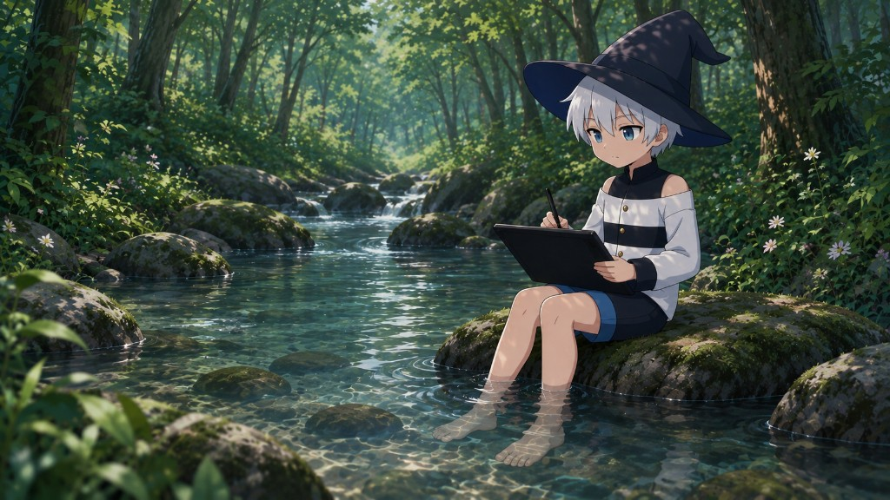
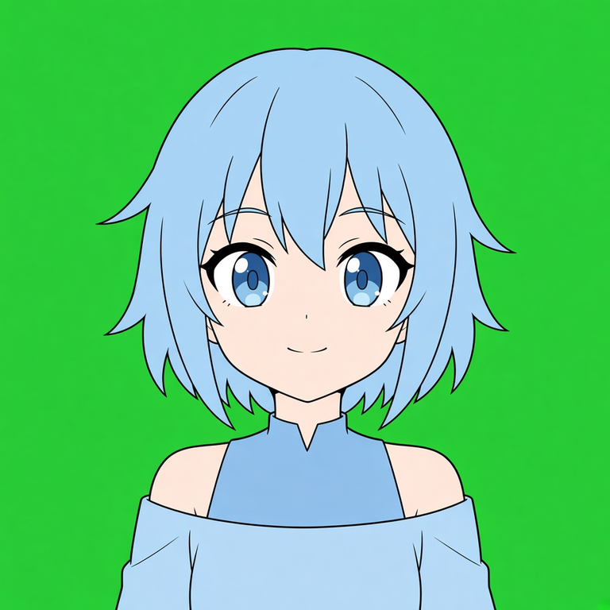
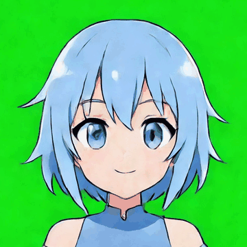
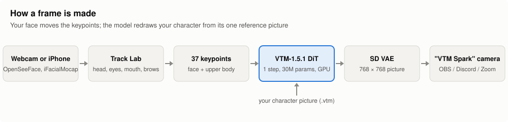
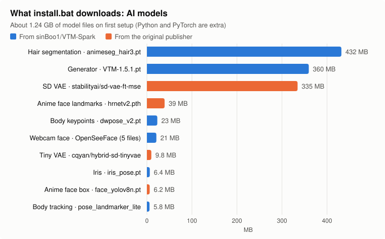

  

<h1 align="center">VTM Spark</h1>

  <b>Turn one anime picture into a live VTuber.</b> 
  Your webcam or iPhone drives the character, an AI model draws every frame, and OBS / Discord / Zoom see it as a normal webcam.

  
  
  

---

## See it

<table>
  <tr>
    <th>You give it one still</th>
    <th>VTM Spark animates it</th>
  </tr>
  <tr>
    <td align="center"></td>
    <td align="center"></td>
  </tr>
</table>

Every frame on the right was drawn by the VTM Spark model from the one picture on the left. It was driven through the same tracking pipeline a live session uses (head turn, nod and tilt, blinks, eye direction, mouth shapes), fed with scripted iPhone-style motion instead of a real face. Blinks use an Eye closed shape made for this character in Track Lab.

<!-- Live demo slot: drag an .mp4 of a real session into GitHub's README editor and paste the link it gives you here. -->

## What it does

- **One picture in, a moving character out.** No rigging, no Live2D model. Give it a chest-up picture of your character.
- **Tracks you live** with any webcam (OpenSeeFace) or an iPhone running iFacialMocap: head turn and tilt, blinks, eye direction, mouth and brows.
- **Draws every frame with an AI model** (a keypoint-driven DiT) on your NVIDIA GPU, in real time.
- **Shows up as a webcam called "VTM Spark"** in OBS, Discord, Zoom, and anything else that takes a camera.
- **Characters are single `.vtm` files** you can keep, back up, and share.
- **Track Lab** lets you tune the mouth shapes, blinks, and how far the head may move, per character.

## How it works

Your face is turned into 37 keypoints (face outline, brows, eyes, irises, nose, mouth, upper body). The model, `VTM-1.5.1`, redraws your character in that pose from its one reference picture, in a single step, and the VAE turns that into a 768 × 768 frame.

## Requirements

- Windows 10 or 11
- An NVIDIA GeForce RTX 30, 40 or 50 series card with a current driver (no AMD, macOS or Linux yet)
- Internet the first time (tools and model weights download automatically; **no API key**)
- A webcam, or an iPhone with the iFacialMocap app

## Install

1. **Download** this repo (green **Code** button, then **Download ZIP**, and unzip it) or clone it.
2. **Double-click `install.bat`.** It sets everything up inside the app folder, then prints an install summary:
   - Python (through [uv](https://docs.astral.sh/uv/)) in `.venv-build`, using your Python 3.10+ if you have one
   - a portable Node.js in `.tools\node`, only for building the UI (your own Node, if any, is untouched)
   - WebView2, Microsoft's runtime for the app window, only if it's missing (Windows 11 already has it)
   - the AI models, the Track Lab tracker, and the virtual camera
3. **Double-click `run.exe`** (the hat icon) to open the desk.

> **One Windows prompt is expected.** Adding the virtual camera needs admin rights once, so Windows asks for permission with the VTM Spark logo and "VTM Spark Camera Setup". Click **Yes**. If you skip it, everything else still works, and you can add the camera later from the app.

You can run `install.bat` again at any time. It repairs whatever is missing and skips what's already done.

## Your first stream

1. **Open the desk** with `run.exe` and pick your language (you can change it later in Settings).
2. **Add a character.** Click the empty character preview, then **Create**, and choose your picture (see [Make a character picture](#make-a-character-picture) below). When it's ready, **Fit character** opens: give it a name and **Save**.
3. **Pick a tracker** under tracking:
   - **Camera**: choose your webcam from the list.
   - **iFacialMocap**: use an iPhone (see [iPhone tracking](#iphone-tracking)).
4. **Start tracking**, look straight ahead with a relaxed face and your mouth closed, and press **Calibrate**. This sets your rest pose.
5. **Start stream.** The first time, this loads the model onto your GPU.
6. **Start cam** to send the character to the virtual camera.
7. In **OBS / Discord / Zoom**, choose the camera named **VTM Spark**. In OBS, add a *Video Capture Device* source and pick **VTM Spark**. The background is green, so a *Chroma Key* filter makes it transparent.

**Pause** holds the last picture if you need a moment.

## Make a character picture

The model works best with a picture laid out exactly like [`character-blueprint/character-blueprint.png`](character-blueprint/character-blueprint.png):

| Keep it like this | Avoid |
|---|---|
| Square, 768 × 768 | Portrait or landscape pictures |
| Solid green background (`#00FF00`) | Rooms, gradients, shadows on the backdrop |
| Chest-up, character centred, facing the camera, chin level | Head tilted or turned |
| Both eyes open, small closed-mouth smile | Open mouth, winking, hands or props in frame |
| One character, no text or logos | Watermarks, UI, extra people |

**Easiest way:** give an image AI two pictures, the blueprint and your own character, together with the prompt in [`character-blueprint/PROMPT.txt`](character-blueprint/PROMPT.txt). The blueprint only sets the framing and pose. Your character's look comes from your own picture.

## iPhone tracking

1. Install **iFacialMocap** on an iPhone with Face ID.
2. Put the iPhone and the PC on the **same Wi-Fi**.
3. In the desk, choose **iFacialMocap**. It shows **This PC** with an IP address (click to copy) and the port, **49983** by default.
4. In iFacialMocap, set that IP address as the destination and start sending.
5. **Start tracking**, then **Calibrate** as usual.

No data arriving? Allow Python through Windows Firewall on **Private** networks, and check that the iPhone is sending to the address the desk shows.

## Characters (`.vtm` files)

A character is one `.vtm` file in the `characters` folder. It holds the picture plus everything fitted to it: the hair mask, body points, movement limits and mouth/eye shapes.

- **Add someone else's character:** **Import .vtm**, or drag the `.vtm` file onto the character preview or library.
- **Share yours:** right-click it, choose **Show in folder**, and send that `.vtm` file.
- **Edit, rename or remove:** right-click a character.
- **"Repair … Blend shapes do not match the current plan":** your Track Lab shapes changed after this character was made. **Repair** copies the current shapes into it. Characters imported from other people keep their own shapes and never ask.

## Track Lab (fine-tuning)

The desk runs Track Lab's tracker in the background, so you never have to open it just to stream. Open it yourself when you want to fine-tune: double-click `track_lab\start.bat`, then go to <http://127.0.0.1:5174>.

- **Blend panel:** the shapes your face drives. Rest, Smile, Sad, the vowels A / I / U / E, and **Eye open / Eye closed** for blinks. Open **›** to edit a shape, drag its points, and press **Apply**. Blend bars between shapes let you add in-between stops for smoother motion.
- **Limiters:** how far the head and body may move, turn and nod before they stop, plus eye and size limits. **Fit** sets them from the picture.
- **Tracking:** **Set Rest** while looking straight ahead with your mouth closed. The Response, Smooth, Mouth and Gaze sliders set how the character follows you.
- **Gen** draws one frame of the character with the current points, which is handy for checking a shape.

Shapes are edited with tracking stopped.

## Settings worth knowing

| Setting | What it does |
|---|---|
| **Smooth** | Softens head motion. 0 is raw; higher floats more. Blinks stay instant. |
| **Mouth** | How strongly the mouth follows yours. |
| **Mirror** | Flips which way looks and head turns go. |
| **Max FPS** | Caps the frame rate to leave GPU room for games or OBS. |
| **Batch** | Frames drawn per step. More FPS but more VRAM and a little delay. |
| **Inbetweens** | Extra pictures between drawn frames for smoother motion. |
| **Compile** | A speed boost for your GPU. The first build can take a minute. |
| **GPU** | Which NVIDIA card to use, if you have more than one (applies after restart). |

## Troubleshooting

| Problem | Fix |
|---|---|
| `install.bat` stops partway | Check your internet connection. Proxies or firewalls blocking nodejs.org, github.com or pypi.org, or antivirus locking `.venv-build`, can stop it. Then run it again. |
| "No NVIDIA GPU found" | VTM Spark needs an NVIDIA RTX card and a current driver. |
| **VTM Spark** camera missing or black in OBS/Discord | Click **Yes** on the camera setup prompt. If you moved the app folder, run `install.bat` again so the camera points at the new place. |
| iPhone: "No packets yet" | Same Wi-Fi on both, allow Python on Private networks in Windows Firewall, and send to the IP and port shown in the desk. |
| "Port 8780 is already in use" | Another program is using Track Lab's port. Close it and start again. |
| "No face while calibrating" | Face the camera with good light, then press **Calibrate** again. |
| The app says it's running but there's no window | Let it clean up the leftover processes when it asks, then open `run.exe` again. |

## Models and licences

`install.bat` downloads the models for you. You never fetch them by hand.

| Model | What it does | Size | Local path | Licence | Commercial use |
|---|---|---|---|---|---|
| `VTM-1.5.1.pt` | Draws your character (DiT) | 360 MB | `models/dit/` | Apache-2.0 (ours) | Yes |
| `vtm-fast-decoder.pt` | Fast picture decode for the live stream | 3.9 MB | `models/decoder/` | Ours, distilled from `cqyan/hybrid-sd-tinyvae`, whose licence is not stated ([notices](THIRD_PARTY_NOTICES.md)) | Unclear |
| `animeseg_hair3.pt` | Hair parts, so hair follows the head | 432 MB | `models/trackers/` | Our fine-tune of Meta Mask2Former, **CC BY-NC 4.0** | **No** |
| `dwpose_v2.pt` | Body keypoints on your picture | 23 MB | `models/trackers/` | Our fine-tune of Ultralytics YOLO-pose, **AGPL-3.0** | Under AGPL terms |
| `iris_pose.pt` | Iris / pupils on your picture | 6.4 MB | `models/trackers/` | Our fine-tune of Ultralytics YOLO-pose, **AGPL-3.0** | Under AGPL terms |
| `pose_landmarker_lite.task` | Live body tracking (MediaPipe) | 5.8 MB | `models/trackers/` | Apache-2.0 (Google) | Yes |
| OpenSeeFace (5 files) | Webcam face tracking | 21 MB | `vendor/tools/openseeface/models/` | BSD 2-Clause | Yes |
| `face_yolov8n.pt` | Anime face box | 6.2 MB | `models/trackers/` | Apache-2.0 ([Bingsu/adetailer](https://huggingface.co/Bingsu/adetailer)) | Yes |
| `mmpose_anime-face_hrnetv2.pth` | Anime face landmarks | 39 MB | `models/trackers/` | MIT ([hysts/anime-face-detector](https://github.com/hysts/anime-face-detector/releases/tag/v0.0.1)) | Yes |
| `stabilityai/sd-vae-ft-mse` | Turns the model's output into a picture | 335 MB | Hugging Face cache | MIT | Yes |
| `cqyan/hybrid-sd-tinyvae` | Faster picture decode | 9.8 MB | Hugging Face cache | Not stated by the publisher | Unclear |

The first seven come from our Hugging Face repo, [sinBoo1/VTM-Spark](https://huggingface.co/sinBoo1/VTM-Spark). The rest come straight from their original publishers. In total that's about 1.24 GB; Python and PyTorch are downloaded separately.

If the DiT weights are missing when you press Start, they download before launch.

## For developers

- `backend/`: the app (`python -m backend`), plus `backend/packaging/` for the install and launcher scripts
- `ui/`: the Vite/React desk
- `track_lab/`: the tracker and Track Lab UI (`python -m backend.pair` from `track_lab/`)
- `vendor/`: inference, LivePoser, OpenSeeFace and the virtual camera
- `models/`: DiT, trackers, download map, references
- `characters/`: your `.vtm` packs (next to the app root)

Tests (optional): `python -m pytest backend/tests` and, from `track_lab/`, `python -m pytest backend harness`.

Vendor code is committed under `vendor/`. Only pass `-SyncVendor` to `backend\packaging\build.ps1` if you are developing inside the optional parent monorepo and need to refresh vendor copies.

## License

Apache License 2.0 covers VTM Spark source and **our** original / fine-tune training work (see [LICENSE](LICENSE)). That grant does **not** cover third-party model weights, and it does not apply to models added later.

Two of the models we ship start from weights with stricter terms, and those terms still apply:

- **`animeseg_hair3.pt`** (hair tracking) is built on Meta's Mask2Former weights: **CC BY-NC 4.0, non-commercial use only**.
- **`iris_pose.pt` and `dwpose_v2.pt`** are built on Ultralytics YOLO-pose weights: **AGPL-3.0**.

The full per-file list is in the [Models and licences](#models-and-licences) table above.

Third-party weights keep the official licence of the publisher who released them. Inventory and source URLs: [THIRD_PARTY_NOTICES.md](THIRD_PARTY_NOTICES.md). OpenSeeFace binary library notices: `vendor/tools/openseeface/Licenses/`.
